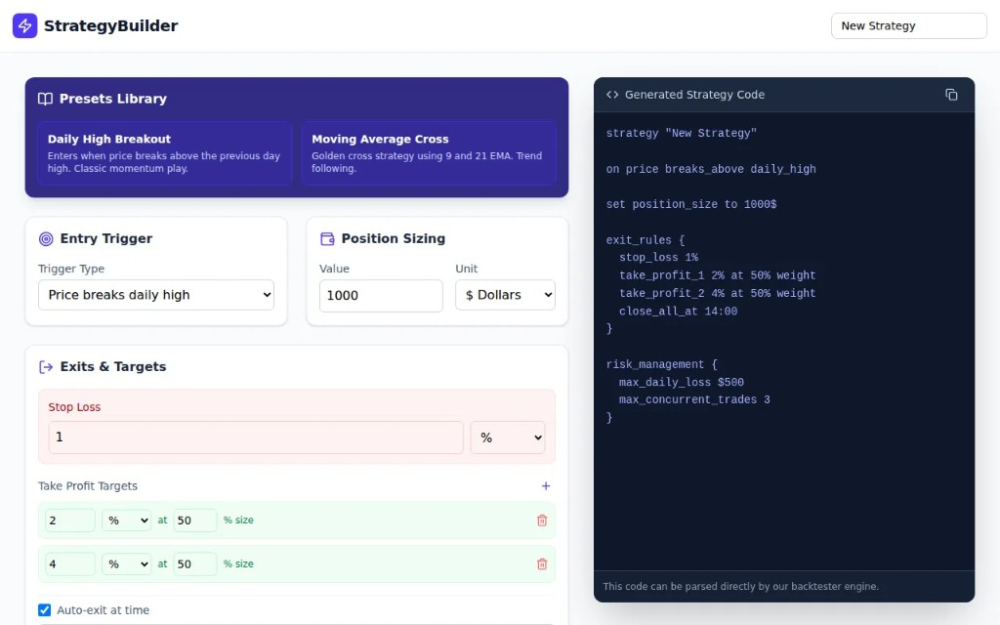

# Strategy Designer (Target UI)



This document captures the **intended** Strategy Designer screen for TapeReplay. It is the product vision for how traders configure strategies without hand-writing DSL. The current MVP implements the same *data model and DSL output* in a simpler form-first layout (`frontend/src/components/StrategyBuilder.jsx`). Future UI work should converge on this mockup.

## Purpose

The Strategy Designer is a no-code surface for defining backtest rules. Every control maps to a field in the strategy DSL. The right pane shows live-generated code that the backend parser and backtest engine consume directly.

Traders should be able to:

- Start from a preset or blank strategy
- Tune entry, sizing, exits, and risk in structured cards
- See the DSL update as they edit
- Copy or run the strategy against a selected ticker and date

## Layout (from mockup)

### Header

- **Title:** StrategyBuilder (purple lightning bolt branding)
- **Action:** New Strategy (reset or create blank config)

### Presets Library (top left)

Pre-built templates that hydrate all cards and the DSL pane:

| Preset | Description | MVP status |
|--------|-------------|------------|
| **Daily High Breakout** | Enter when price breaks above the previous day's high (momentum play) | Implemented (only preset) |
| **Moving Average Cross** | Golden cross using 9 and 21 EMA (trend following) | Future |

Selecting a preset loads its defaults. MVP ships one strategy; the library UI is deferred.

### Configuration Cards (center)

#### Entry Trigger

- Dropdown for trigger type
- Mockup shows: **Price breaks daily high**
- Maps to DSL: `on price_breaks_above_daily_high`

#### Position Sizing

- Numeric amount with unit selector (e.g. **$ Dollars**)
- Mockup default: `1000`
- Maps to DSL: `set position_size to 1000 USD`

#### Exits & Targets

Grouped exit rules in one card:

- **Stop Loss:** percent (mockup: `1%`, red highlight for risk)
- **Take Profit Targets:** ladder with percent and size weight
  - Target 1: `2% at 50% size`
  - Target 2: `4% at 50% size`
  - Add (+) control for more targets
- **Time-based Exit:** checkbox for auto-exit at a market time (mockup: `14:00`)

Maps to DSL `exit_rules { ... }` block.

#### Risk Management (DSL block, implied in mockup footer)

Not shown as separate cards in the mockup but present in generated code:

```
risk_management {
  max_daily_loss 500 USD
  max_concurrent_trades 3
}
```

MVP exposes these as form fields below the exit card.

### Generated Strategy Code (right pane)

Dark code panel with copy action. Updates live as cards change.

Example output from the mockup (canonical backend form may differ slightly in syntax):

```text
strategy "New Strategy"

on price_breaks_above_daily_high

set position_size to 1000 USD

exit_rules {
  stop_loss 1%
  take_profit_1 2% at 50% weight
  take_profit_2 4% at 50% weight
  close_all_at 14:00
}

risk_management {
  max_daily_loss 500 USD
  max_concurrent_trades 3
}
```

Footer note in mockup: *"This code can be parsed directly by our backtester engine."*

That is the contract: UI is a visual editor for DSL text the backend already understands.

## MVP vs Target

| Area | MVP (shipped) | Target (mockup) |
|------|---------------|-----------------|
| Layout | Single-column form | Two-column: cards + live DSL pane |
| Presets | Hard-coded Daily High Breakout defaults | Presets library with selectable templates |
| Entry trigger | Fixed breakout (read-only label) | Dropdown (multiple trigger types later) |
| DSL preview | On-demand via Preview DSL button | Live, always visible, copyable |
| Visual design | Tailwind dark form | Card-based designer with purple accent branding |
| Ticker / date | In StrategyBuilder form | Likely global or header context (TBD) |
| Moving Average Cross | Not built | Preset placeholder in mockup |

Backend DSL parser, strategy config model, and backtest engine already align with the mockup's generated code. The gap is **presentation and UX**, not engine capability for the breakout strategy.

## Design Principles (lock these in)

1. **DSL is the source of truth.** UI edits produce parseable text; backend never depends on opaque UI-only state.
2. **Presets are starter configs**, not separate code paths. Each preset is a `StrategyConfig` snapshot.
3. **Cards map 1:1 to DSL sections:** entry, sizing, `exit_rules`, `risk_management`.
4. **No em dashes in UI copy.** Use commas, colons, periods, parentheses.
5. **Keep strategy logic pluggable.** New presets add new `IStrategy` implementations and trigger types, not forks of the engine.

## Implementation Notes for Future UI Work

When building toward the mockup:

- Split `StrategyBuilder.jsx` into: `PresetsLibrary`, `EntryTriggerCard`, `PositionSizingCard`, `ExitsTargetsCard`, `GeneratedCodePane`
- Wire card state to `POST /api/strategy/generate` on debounced change for live DSL
- Add copy-to-clipboard on the code pane
- Style presets as selectable chips/cards with short descriptions
- Ticker and date may move to dashboard header or a separate "Run" bar

Reference implementation today: `frontend/src/components/StrategyBuilder.jsx`

## Related Docs

- [Scope and Purpose](scope-and-purpose.md)
- [README](../README.md)
